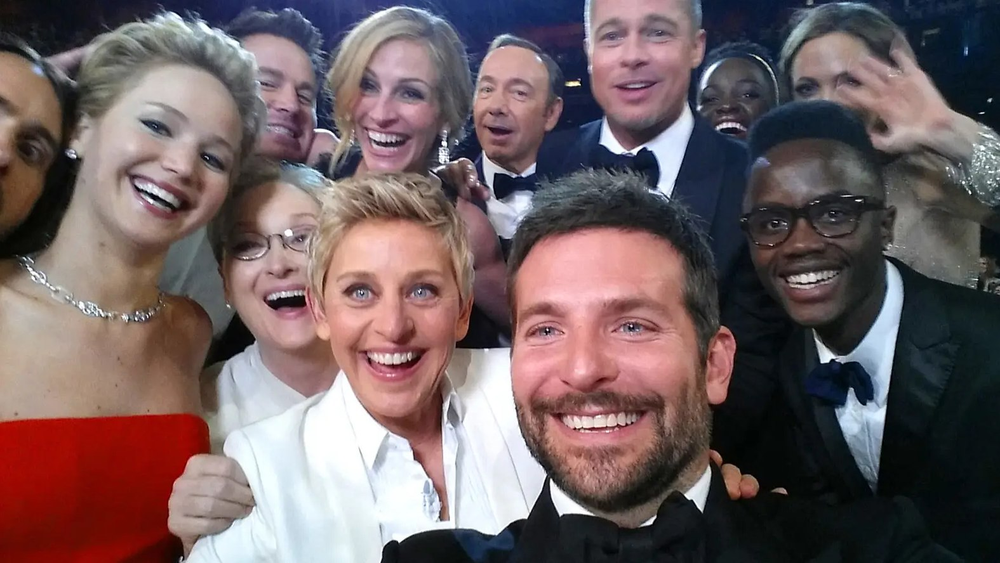
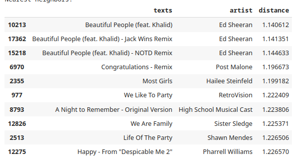

# Hackathon Semcomp 2023
## Piquete Pitico
### Temática
O nosso grupo buscou integrar as ferramentas da **Cohere** para aumentar a conexão do público geral com a **música**. 
Para isso, decidiu-se fazer uma forma de receber sugestões de músicas dada uma foto. Entendemos que esse tema tem um impacto grande em um público diverso, seja ele:

* Um casal que deseja ter uma playlist literalmente à sua cara.
* Uma pessoa que quer eternizar uma viagem com faixas nostálgicas.
* Um grupo de amigos que gostariam de complementar o registro de um momento especial com músicas.
* Uma pessoa desejar realizar um post no Instagram com um par perfeito de música e foto.

### Solução
Para que realizar esse projeto seja possível, é inprescindível a ajuda da Cohere com a disponibilidade de suas ferramentas. Com isso em mente, o nosso projeto constituiu das seguintes etapas:
1. Coletar uma boa quantidade de músicas e imagens
   * Utilizamos o dataset [audio features and lyrics of spotify songs](https://www.kaggle.com/datasets/imuhammad/audio-features-and-lyrics-of-spotify-songs) que além de nome e letras de 18000 músicas, contém também aspectos como danceability, energy, speechiness,	acousticness,	instrumentalness,	liveness, e	valence.
   * Utilizamos algumas fotos com teste, algumas vindas do dataset [flickr image dataset](https://www.kaggle.com/datasets/hsankesara/flickr-image-dataset).
2. Gerar os embeddings de um conjunto limitado de músicas
   *  Realiza-se uma filtragem pelo nível de popularidade, permitindo que apenas músicas mais conhecidas aparecerem na recomendação.
   *  É efetuado uma etapa de pré-processamento para selecionar características da música através de thresholds  (ex.: danceability > 0.5 implica na música ser dançavel).
   *  Utilizamos a API da Cohere para geração de embeddings de 5000 músicas que consideram a letra e as características das músicas.
3. Geração de descrição de imagem
   * Fez-se o uso de outros algoritmos que realizam funções de Legenda e Detecção de Emoções para descrição textual da imagem.
   * Artigo sobre Legenda de Imagens: [BLIP: Bootstrapping Language-Image Pre-training for Unified Vision-Language Understanding and Generation](https://arxiv.org/abs/2201.12086)
   * Artigo sobre Detecção de Emoções em Imagens: [An Image is Worth 16x16 Words: Transformers for Image Recognition at Scale](https://arxiv.org/abs/2010.11929)
4. Gerar os embeddings da imagem
   * Usando a descrição da imagem obtida no passo 3 e o endpoint de Embed da Cohere foi possível gerar a descrição vetorial da figura.
5. Nearest Neighbors Search (NNS)
   * Plottar os embeddings das músicas para entender como as músicas se aproximam no espaço através de suas representações vetoriais.
   * Utilizamos o algoritmo NNS com a biblioteca Annoy do Spotify para encontrar um ranking de músicas mais semelhantes a imagem obtida no passo anterior.
6. Coletar melhores músicas
   * As menores distâncias representam as músicas que mais combinam com a imagem e, portanto, seriam as recomendadas.
  
### Utilização
A partir do input "arafed group of people posing for a selfie at a formal event  feeling: happy" da foto de Ellen DeGeneres no Oscar

obtemos as seguintes recomendações

